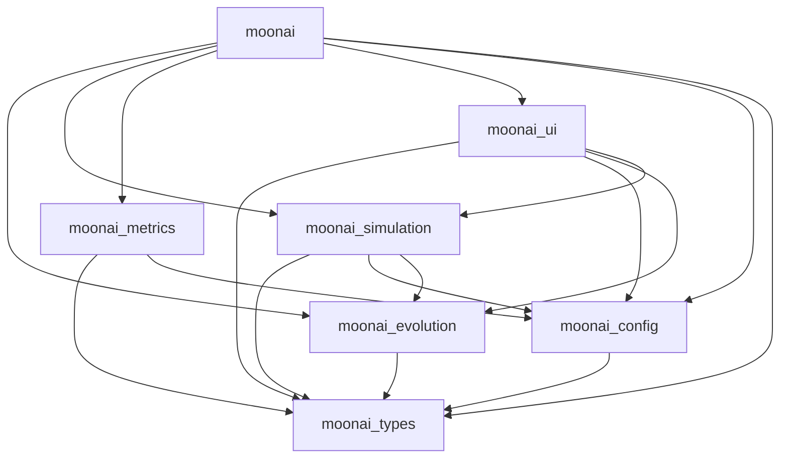
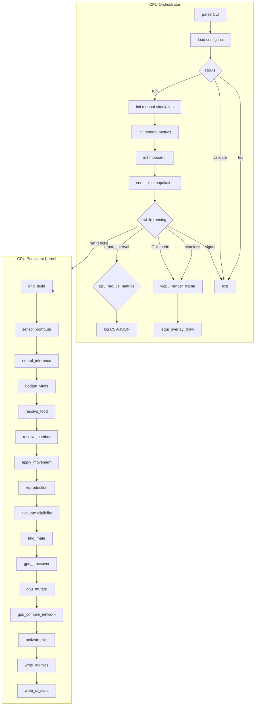
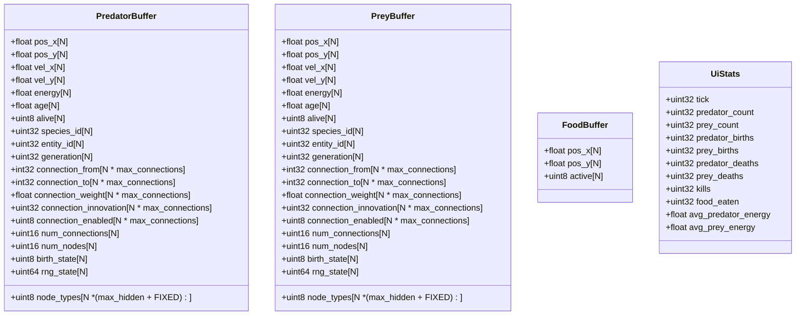
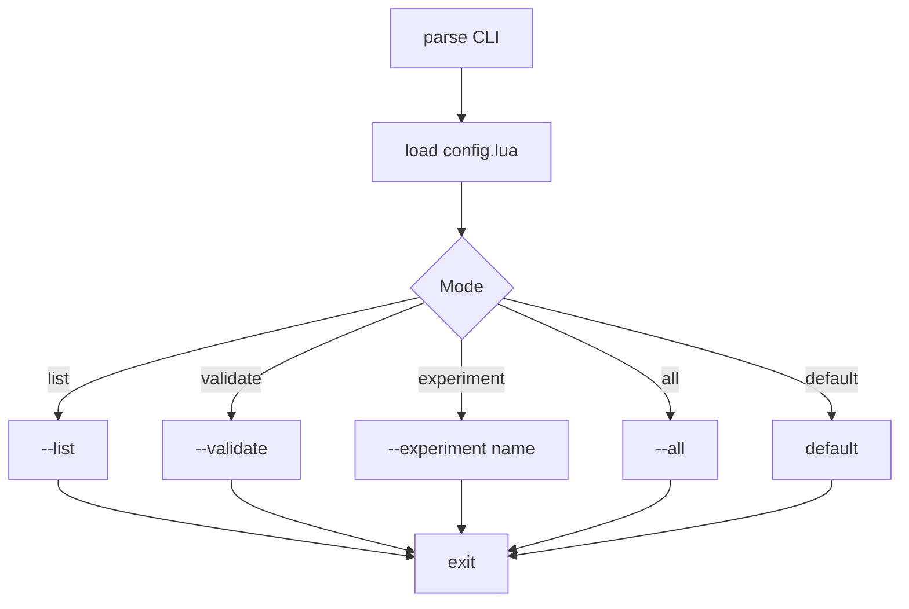

# MoonAI Rewtite Plan

> **Legacy C++ Implementation**: The original C++ simulation code is preserved in `legacy/`. This legacy codebase can be inspected for reference but is no longer actively developed. It includes the CMake build system, full SFML visualization, and all original NEAT implementation details. All C++ build configuration (CMakeLists.txt, CMakePresets.json, .clang-format, .clang-tidy, vcpkg.json), source code (main.cpp, app/, core/, evolution/, metrics/, simulation/, visualization/), and architecture documentation (architecture.md) are located in `legacy/`.

## 1. System Architecture

### 1.1 Module Dependency Graph



### 1.2 Tick Execution Flow



### 1.3 GPU Memory Layout



### 1.4 CLI Interface

**CLI flags:**

| Flag                  | Description                                         |
| --------------------- | --------------------------------------------------- |
| `-c, --config <path>` | Path to Lua config file (default: binary directory) |
| `--settings <path>`   | Path to settings.json (default: binary directory)   |
| `-n, --ticks <n>`     | Override max ticks (`0` = infinite)                 |
| `--headless`          | Run without visualization                           |
| `-v, --verbose`       | Enable debug logging                                |
| `--experiment <name>` | Select one experiment by name                       |
| `--all`               | Run all experiments sequentially (headless only)    |
| `--list`              | List experiment names and exit                      |
| `--name <name>`       | Override output directory name                      |
| `--validate`          | Load + validate config, print result, exit          |
| `-h, --help`          | Show CLI help                                       |

**CLI routing:**



## 2. Design Principles

1. **GPU owns all simulation state** — positions, velocities, energy, age, alive flags, genomes, innovation counters, all live in GPU memory.
2. **CPU is orchestrator only** — never iterates the agent population except for initial population seeding and metrics export.
3. **Tick-based cadence** — GPU runs N simulation ticks per tick; CPU handles metrics logging between ticks.
4. **GPU-native evolution** — crossover, mutation, and network compilation happen entirely on GPU via `moonai-evolution` CUDA kernels.
5. **Buffer expansion** — buffers grow by 2x when capacity threshold is reached. No artificial ceiling.
6. **No duplication** — evolution logic lives in `moonai-evolution` only; `moonai-simulation` calls those kernels.

## 3. Assumptions

- `config.lua` contains **simulation config only** (no UI overrides).
- `settings.json` contains **UI config** — loaded from binary directory or explicit path.
- File locations: `config.lua` and `settings.json` live next to the binary executable.
  Lookup order: explicit path via CLI flag → binary directory → fallback to defaults.
- `UiConfig` defaults are hardcoded in Rust; `settings.json` overrides them.
- `UiState` (paused, speed_multiplier, tick_requested, selected_agent_id) is **runtime state**,
  lives in `moonai-ui/types.rs`. NOT in `moonai-config`.
- Output schema stays unchanged so Python analysis keeps working.
- Behavioral parity is the goal.
- Predator and prey use separate GPU buffers; no `AgentType` enum needed.
- `config.lua` is loaded via `mlua`. `moonai_defaults` is injected as a global table.
- CLI `--experiment` flag is a string passthrough; experiment selection logic is in `moonai` crate.
- Reproduction is **sexual** — two parent genomes crossover on GPU, mutation applied on GPU, network compiled on GPU.
- FPS target: 120fps. Speed multiplier: 1x-1024x ticks per frame. Every frame renders everything live.
- UI needs fresh data every frame: population counts, positions, velocities, all of it.

## 4. Technology Choices

| Concern            | C++           | Rust/GPU-First                     |
| ------------------ | ------------- | ---------------------------------- |
| Language           | C++17         | Rust 2024                          |
| CUDA binding       | raw CUDA      | `cxx` (supports CUDA natively)     |
| Logging            | spdlog        | `tracing` + `tracing-subscriber`   |
| JSON               | nlohmann/json | `serde` + `serde_json`             |
| Lua binding        | Lua C API     | `mlua` crate                       |
| GUI framework      | SFML          | winit + egui + wgpu                |
| GPU rendering      | SFML shapes   | wgpu instanced rendering           |
| Atomic counters    | —             | CUDA atomics for GPU-to-CPU events |
| Genome compilation | CPU (rayon)   | GPU (persistent kernel)            |

## 5. Crate Architecture

```
Cargo.toml
crates/
  moonai-config/
    Cargo.toml
    src/
      lib.rs            # re-exports Config, CliArgs, UiConfig, ConfigError
      config.rs         # SimulationConfig (serde, with defaults)
      cli.rs            # CliArgs struct + clap parsing
      lua.rs            # Lua loading, moonai_defaults injection
      ui.rs             # UiConfig (hardcoded defaults)
      settings.rs       # settings.json loading
      error.rs         # ConfigError, validate_config

  moonai-types/
    Cargo.toml
    src/lib.rs          # Vec2, INVALID_ENTITY, SENSOR_COUNT (35),
                        # OUTPUT_COUNT (2), NodeType, NodeGene,
                        # ConnectionGene, deterministic_respawn, tracing setup

  moonai-evolution/
    Cargo.toml
    build.rs            # Compiles .cu files via cxx
    src/
      lib.rs            # Genome, NeuralNetwork, Mutation, Crossover,
                        # Species, InnovationTracker, EvolutionManager,
                        # CompiledNetwork
      genome.rs         # Genome struct, methods
      network.rs        # NeuralNetwork, activate
      innovation.rs     # InnovationTracker
      mutation.rs       # Mutation operations
      crossover.rs      # Crossover operations
      species.rs        # Species, compatibility
      evolution.rs      # EvolutionManager
      compiled.rs       # CompiledNetwork
      crossover.cu      # GPU kernel: genome crossover
      mutation.cu       # GPU kernel: weight mutate, add_connection, add_node
      network_compilation.cu  # GPU kernel: compile genome to inference format

  moonai-simulation/
    Cargo.toml
    build.rs            # Compiles kernel.cu
    src/
      lib.rs            # SimulationState, GpuHandles, TickResult,
                        # run_tick, read_metrics, read_selected_agent,
                        # init_from_config, init_from_genomes
      kernel.cu         # Persistent simulation kernel
                        # NOTE: Calls evolution kernels from moonai-evolution.
                        # Does NOT implement crossover/mutation/reproduction.
      buffers.rs        # GPU SoA buffers (agents, food)
      checks.rs         # CUDA_CHECK macro
      inference.rs      # Neural inference kernel
      reproduction.rs   # Mate finding, birth buffer management
      metrics_reduce.rs # Metrics reduction kernel
      compaction.rs     # GPU defragmentation

  moonai-metrics/
    Cargo.toml
    src/lib.rs          # Logger, stats.csv, species.csv, genomes.json

  moonai-ui/
    Cargo.toml
    src/
      lib.rs            # App, winit event loop, egui overlay
      render.rs         # wgpu world renderer
      types.rs          # UiState (RUNTIME STATE), OverlayStats,
                        # RenderFood, RenderAgent, RenderLine

  moonai/
    Cargo.toml
    src/
      main.rs           # binary entrypoint
      signal.rs         # SIGINT/SIGTERM graceful shutdown
```

### Crate Responsibilities

| Crate               | Owns                                                                                                                              | Depends on                                                               |
| ------------------- | --------------------------------------------------------------------------------------------------------------------------------- | ------------------------------------------------------------------------ |
| `moonai-config`     | SimulationConfig, CliArgs, UiConfig, ConfigError, Lua loading                                                                     | `moonai-types`                                                           |
| `moonai-types`      | Vec2, NodeType, NodeGene, ConnectionGene, SENSOR_COUNT, OUTPUT_COUNT, INVALID_ENTITY                                              | —                                                                        |
| `moonai-evolution`  | ALL NEAT evolution logic: CUDA kernels for crossover, mutation, network compilation, InnovationTracker, Species, EvolutionManager | `moonai-types`                                                           |
| `moonai-simulation` | GPU SoA buffers, persistent simulation kernel (calls evolution kernels), spatial grid, inference, metrics reduce, UI stats write  | `moonai-types`, `moonai-config`, `moonai-evolution`                      |
| `moonai-metrics`    | CSV/JSON file logging                                                                                                             | `moonai-types`, `moonai-config`                                          |
| `moonai-ui`         | winit, egui panels, wgpu world renderer, UiState (runtime)                                                                        | `moonai-types`, `moonai-config`, `moonai-evolution`, `moonai-simulation` |
| `moonai`            | main.rs, signal handling                                                                                                          | All above                                                                |

## 6. Phase Specifications

### Phase 1 — Workspace Skeleton [x]

**Goal:** Empty but compilable workspace

| #   | Task                            | File Changes                                                                              | Verification                       | Status |
| --- | ------------------------------- | ----------------------------------------------------------------------------------------- | ---------------------------------- | ------ |
| 1   | Create `Cargo.toml` workspace   | `Cargo.toml`                                                                              | `cargo metadata` succeeds          | [x]    |
| 2   | Create `moonai-config` stub     | `moonai-config/Cargo.toml`, `moonai-config/src/lib.rs`                                    | `cargo build -p moonai-config`     | [x]    |
| 3   | Create `moonai-types` stub      | `moonai-types/Cargo.toml`, `moonai-types/src/lib.rs`                                      | `cargo build -p moonai-types`      | [x]    |
| 4   | Create `moonai-evolution` stub  | `moonai-evolution/Cargo.toml`, `moonai-evolution/src/lib.rs`, `moonai-evolution/build.rs` | `cargo build -p moonai-evolution`  | [x]    |
| 5   | Create `moonai-simulation` stub | same pattern                                                                              | `cargo build -p moonai-simulation` | [x]    |
| 6   | Create `moonai-metrics` stub    | same pattern                                                                              | `cargo build -p moonai-metrics`    | [x]    |
| 7   | Create `moonai-ui` stub         | same pattern                                                                              | `cargo build -p moonai-ui`         | [x]    |
| 8   | Create `moonai` binary stub     | same pattern                                                                              | `cargo build -p moonai`            | [x]    |
| 9   | Verify workspace                | —                                                                                         | `cargo build --workspace`          | [x]    |

### Phase 2 — moonai-config [x]

**Goal:** `moonai-config` fully implemented — simulation params, CLI, UI config, Lua loading

| #   | Task                                                                                    | Verification                              | Status |
| --- | --------------------------------------------------------------------------------------- | ----------------------------------------- | ------ |
| 1   | `SimulationConfig` with all fields + serde (C++-aligned defaults)                       | `cargo check -p moonai-config`            | [x]    |
| 2   | `CliArgs` + clap parsing (`--experiment`, `--all`, `--headless`, `-n`, etc.)            | `cargo run -- --list` works               | [x]    |
| 3   | `UiConfig` with **hardcoded defaults** (50+ fields from legacy constants.hpp)           | Unit tests                                | [x]    |
| 4   | Lua loading — inject `moonai_defaults`, parse experiment table                          | `cargo run -- --validate` works           | [x]    |
| 5   | `ConfigError` + `validate_config` (all 24 legacy validation rules)                      | `cargo run -- --validate` passes defaults | [x]    |
| 6   | `settings.json` loading for UI config (separate from simulation config)                 | `load_settings` returns UiConfig          | [x]    |
| 7   | Experiment routing in `moonai` binary (`--list`, `--validate`, `--experiment`, `--all`) | All CLI flags work end-to-end             | [x]    |

**Note:** UI config comes exclusively from `settings.json` — Lua does not support UI overrides.

### Phase 2b — moonai-types (Pure NEAT Types) [x]

**Goal:** `moonai-types` contains only genetic/simulation types — no config structs

| #   | Task                                                                          | Verification              | Status |
| --- | ----------------------------------------------------------------------------- | ------------------------- | ------ |
| 1   | `Vec2`, constants (`SENSOR_COUNT` (35), `OUTPUT_COUNT` (2), `INVALID_ENTITY`) | Unit tests                | [x]    |
| 2   | `NodeType`, `NodeGene`, `ConnectionGene`                                      | Unit tests                | [x]    |
| 3   | `deterministic_respawn`                                                       | Deterministic output test | [x]    |

### Phase 3 — Evolution (GPU CUDA Kernels)

**Goal:** `moonai-evolution` owns all NEAT logic as CUDA kernels — no duplication

#### 3a. Data Structures

| #   | Task                                                                                        | Verification                               |
| --- | ------------------------------------------------------------------------------------------- | ------------------------------------------ |
| 1   | Implement `Genome` struct with `Vec<NodeGene>`, `Vec<ConnectionGene>`                       | `cargo test -p moonai-evolution -- genome` |
| 2   | Implement `Genome::add_node`, `add_connection`, `has_connection`, `has_node`, `max_node_id` | Unit tests                                 |
| 3   | Implement `Genome::complexity`, `compatibility_distance`                                    | Unit tests                                 |
| 4   | Implement `InnovationTracker` with global counter                                           | Unit tests                                 |
| 5   | Implement `NeuralNetwork::activate`, `activate_into`                                        | Compare with C++ forward pass              |

#### 3b. CPU Reference Operations (for algorithm validation)

| #   | Task                                                                          | Verification                |
| --- | ----------------------------------------------------------------------------- | --------------------------- |
| 6   | Implement `crossover` function (sexual, matching by innovation)               | Unit tests (property-based) |
| 7   | Implement `mutate_weights`, `add_connection`, `add_node`, `delete_connection` | Unit tests                  |
| 8   | Implement `Species` compatibility, add_member, refresh                        | Unit tests                  |
| 9   | Implement `EvolutionManager::seed_initial_population`, `reproduce_population` | Integration test            |

#### 3c. CUDA Kernel Implementation

| #   | Task                                            | Algorithm                                                                                                                                                                                       |
| --- | ----------------------------------------------- | ----------------------------------------------------------------------------------------------------------------------------------------------------------------------------------------------- |
| 10  | `crossover.cu` — `gpu_crossover_kernel`         | 1 thread per offspring. Sort parent connections by innovation (warp-level bitonic). Merge with 50%/50% inheritance rules.                                                                       |
| 11  | `mutation.cu` — `gpu_mutate_kernel`             | Per-agent: weight perturbation (Gaussian), add_connection (atomic innovation counter + linear scan), add_node (disable connection + 2 new connections with atomic counters), delete_connection. |
| 12  | `network_compilation.cu` — `gpu_compile_kernel` | Topological sort of nodes → eval_order[]. Build conn_ptr[] offsets. Copy weights to inference arrays.                                                                                           |

### Phase 4 — GPU Simulation Kernel

**Goal:** `moonai-simulation` persistent kernel calls `moonai-evolution` CUDA kernels

#### 4a. GPU Buffers

| #   | Task                         | Notes                                     |
| --- | ---------------------------- | ----------------------------------------- |
| 1   | `PredatorBuffer` SoA layout  | All genome arrays in-place                |
| 2   | `PreyBuffer` SoA layout      | Same as predator                          |
| 3   | `FoodBuffer`                 | pos_x, pos_y, active                      |
| 4   | `UiStats` pinned host-mapped | Written every tick, CPU reads with memcpy |
| 5   | Free list ring buffer        | Push dead slots, pop for births           |

#### 4b. Persistent Kernel Phases

| #   | Phase               | Calls                | Algorithm                                      |
| --- | ------------------- | -------------------- | ---------------------------------------------- |
| 1   | `grid_build`        | —                    | Count-scan-scatter into spatial cells          |
| 2   | `sensor_compute`    | —                    | Search 5 nearest predators/prey/food per agent |
| 3   | `inference`         | —                    | Forward pass tanh activation                   |
| 4   | `update_vitals`     | —                    | Energy drain, age++, death check               |
| 5   | `resolve_food`      | —                    | Prey claim food in range                       |
| 6   | `resolve_combat`    | —                    | Predator claim prey in range                   |
| 7   | `apply_movement`    | —                    | NN output → position update                    |
| 8   | `reproduction`      | —                    |                                                |
| 8a  | evaluate            | —                    | Energy >= threshold, not used this tick        |
| 8b  | find_mate           | —                    | DenseReproductionGrid search                   |
| 8c  | gpu_crossover       | **moonai-evolution** | Calls crossover.cu kernel                      |
| 8d  | gpu_mutate          | **moonai-evolution** | Calls mutation.cu kernel                       |
| 8e  | gpu_compile_network | **moonai-evolution** | Calls network_compilation.cu                   |
| 8f  | activate_slot       | —                    | Mark birth_state=ACTIVE                        |
| 9   | `write_ui_stats`    | —                    | Pinned memory write                            |

#### 4c. Metrics Reduce

| #   | Task                                                | Notes                           |
| --- | --------------------------------------------------- | ------------------------------- |
| 10  | Launch `metrics_reduce_kernel` at `report_interval` | Warp reduction → compact struct |

#### 4d. Buffer Management

| #   | Task                           | Trigger                             |
| --- | ------------------------------ | ----------------------------------- |
| 11  | Buffer expansion               | `live_count > capacity * 0.9`       |
| 12  | Compaction (mark-scatter-swap) | `free_list empty && births pending` |

### Phase 5 — Metrics

**Goal:** Output files match C++ schema exactly

| #   | Task            | Details                                                                                                                                                                                                                                                                                                      |
| --- | --------------- | ------------------------------------------------------------------------------------------------------------------------------------------------------------------------------------------------------------------------------------------------------------------------------------------------------------ |
| 1   | `Logger` struct | `YYYYMMDD_HHMMSS_seedN` directory                                                                                                                                                                                                                                                                            |
| 2   | `stats.csv`     | tick, predator_count, prey_count, predator_births, prey_births, predator_deaths, prey_deaths, predator_species, prey_species, avg_predator_complexity, avg_prey_complexity, avg_predator_energy, avg_prey_energy, max_predator_generation, avg_predator_generation, max_prey_generation, avg_prey_generation |
| 3   | `species.csv`   | tick, population, species_id, size, avg_complexity                                                                                                                                                                                                                                                           |
| 4   | `genomes.json`  | Representative genome snapshots                                                                                                                                                                                                                                                                              |

### Phase 6 — Headless Runtime (Milestone)

**Verification Gates:**

| Gate             | Command                                                             | Success Criteria                                                  |
| ---------------- | ------------------------------------------------------------------- | ----------------------------------------------------------------- |
| Evolution tests  | `cargo test -p moonai-evolution`                                    | All tests pass                                                    |
| Build parity     | `cargo build --workspace`                                           | All crates compile, no CMake                                      |
| Config parity    | `cargo run -- --validate config.lua`                                | Config loads                                                      |
| Headless runtime | `./moonai config.lua --experiment baseline --headless --ticks 1000` | Produces stats.csv, species.csv, genomes.json matching C++ output |

### Phase 7 — UI

**File structure:**

```
crates/moonai-ui/
├── Cargo.toml
└── src/
    ├── lib.rs        # App, winit event loop, pause/tick/speed controls
    ├── render.rs     # wgpu instanced rendering (positions from GPU buffers)
    └── types.rs      # UiState (RUNTIME STATE, not config), OverlayStats,
                      # RenderFood, RenderAgent, RenderLine
```

**Note:** `UiState` (paused, speed_multiplier, tick_requested, selected_agent_id) is **runtime
state** — it is NOT config. It lives in `moonai-ui/types.rs` and is never serialized.

**Render pipeline:**

```
GPU buffers → wgpu buffer → instanced draw predator/prey/food
                                    ↓
                            vision circle (on-click GPU kernel)
                            sensor lines   (on-click GPU kernel)
```

**Controls:**

| Key/Action        | Behavior                                                                  |
| ----------------- | ------------------------------------------------------------------------- |
| Space             | Pause / resume (stops GPU tick loop)                                      |
| ↑ / ↓ or + / -    | Increase / decrease simulation speed (1x–1024x, 2x per press)             |
| .                 | Step one tick (while paused)                                              |
| S                 | Save screenshot                                                           |
| Esc               | Quit                                                                      |
| Home              | Reset camera to default zoom and center                                   |
| Left-click        | GPU computes agent features → read staging buffer → show stats + NN panel |
| Middle-click drag | Pan camera                                                                |
| Right-click drag  | Pan camera                                                                |
| Scroll wheel      | Zoom                                                                      |

### Phase 8 — Cleanup

Delete `legacy/` directory after Rust rewrite is complete and verified.

```bash
rm -rf legacy/
```

## 7. GPU Kernel Reference

### 7.1 `crossover.cu` — High-Level Algorithm

```
gpu_crossover_kernel(parent_a_ptr, parent_b_ptr, offspring_ptr, rng_state_ptr):
    tid = blockIdx.x * blockDim.x + threadIdx.x
    if tid >= num_offspring: return

    // 1. Read parent connection arrays into shared memory (32 threads cooperatively)
    // 2. Warp-level bitonic sort by innovation number
    // 3. Merge phase:
    //    for each innovation in union:
    //      if in both parents:
    //        inherit = (rand() < 0.50) ? parent_a : parent_b
    //      elif in one parent:
    //        inherit = (rand() < 0.50) ? parent_with_gene : DISABLED
    // 4. Disable mismatched with 75% probability
    // 5. Write child genome to offspring_ptr
```

### 7.2 `mutation.cu` — High-Level Algorithm

```
gpu_mutate_kernel(genome_ptr, innovation_counter, rng_state_ptr, config):
    tid = blockIdx.x * blockDim.x + threadIdx.x
    if tid >= num_agents: return

    // Per-agent mutations (independent):

    // Weight perturbation
    if rand() < config.weight_mutation_rate:
        for each connection:
            if rand() < config.prob_mutate_weight:
                weight += Gaussian(rand(), config.weight_perturb_strength)

    // Add connection
    if rand() < config.add_connection_rate:
        for attempt in 0..max_attempts:
            from, to = random_node_pair()
            if not has_connection(genome, from, to):
                new_innov = atomic_inc(innovation_counter)
                add_connection(genome, from, to, new_innov)
                break

    // Add node
    if rand() < config.add_node_rate:
        conn = random_enabled_connection(genome)
        if conn exists:
            new_node = atomic_inc(next_node_id)
            disable_connection(genome, conn)
            i1 = atomic_inc(innovation_counter)
            i2 = atomic_inc(innovation_counter)
            add_connection(genome, conn.from, new_node, i1)
            add_connection(genome, new_node, conn.to, i2)
```

### 7.3 `network_compilation.cu` — High-Level Algorithm

```
gpu_compile_network_kernel(slot_id, genome_ptr, inference_ptr):
    // 1. Topological sort nodes → eval_order[]
    // 2. Build conn_ptr[] — offset into conn_from[] for each node
    // 3. Copy weights, enabled flags into inference arrays
    // 4. Mark output node indices
```

## 8. GPU-Side Innovation Tracking

NEAT innovation tracking requires assigning globally unique innovation IDs to new structural mutations. A GPU hash map (open addressing) suffers from bank conflicts under heavy concurrent insert from thousands of threads. Instead, use **atomic counter + direct assignment**:

```
Global GPU state:
  innovation_counter: atomic<uint32>   // monotonic, starts at (num_inputs + num_outputs + 1)
  next_node_id: atomic<uint32>        // monotonic for hidden nodes

Per-tick innovation log (append-only):
  innovation_log[tick][innovation_id] = {from_node, to_node, innovation_type}
  // Used for matching homologues during crossover
```

**Mutation -- add_connection**:

1. Pick random `(from_node, to_node)` pair
2. Check if connection exists by scanning this agent's connection array (O(C), typically <500)
3. If not found and `num_connections < max_connections`: atomically increment `innovation_counter` -> new ID -> insert connection

**Mutation -- add_node**:

1. Pick random enabled connection `(a, b)` with innovation `I`
2. Atomically increment `next_node_id` -> hidden node `h`
3. Atomically increment `innovation_counter` twice -> `I1`, `I2`
4. Disable connection `(a, b)`, insert `(a, h): I1`, `(h, b): I2`

**Why this is fast**:

- No hash map contention -- atomics only on counter increments (1-2 ops each)
- Connection existence check is a simple linear scan -- O(C) is fine since most connections do not mutate
- All other mutations (weight perturbation, enable/disable) are data movement, no atomics

## 9. UI Data Path

GPU writes a compact `UiStats` struct to a **pinned host-mapped buffer** every tick. CPU reads it with a single `memcpy`. No kernel launch needed.

```
UiStats (pinned, written every tick):
  tick, predator_count, prey_count
  predator_births, prey_births
  predator_deaths, prey_deaths
  kills, food_eaten
  avg_predator_energy, avg_prey_energy

render pass (wgpu, no CPU readback):
  predator positions -> GPU buffer -> instanced draw
  prey positions -> GPU buffer -> instanced draw
  food positions -> GPU buffer -> instanced draw
  vision circle, sensor lines -> computed on GPU on-demand (click), read via staging buffer
```

**Selected Agent Readback (On Demand)**:

```
User clicks agent:
  GPU: kernel_compute_selected_agent_features(slot_id, staging_buffer)
    - sensor lines (5 nearest predators, prey, food)
    - vision circle
    - node activations (forward pass)
  CPU: cudaMemcpy async -> read staging buffer -> update NN panel
```

## 10. Buffer Expansion

```
Trigger: when live_count > capacity * 0.9

Expansion:
  new_capacity = capacity * 2
  allocate new buffer (all SoA arrays)
  gpu_copy_all(old_buffer, new_buffer, live_count)
  swap buffer pointers

No artificial ceiling. Buffers grow as needed.
```

## 11. Compaction

Compaction is NOT for ceiling avoidance -- it is for reclaiming dead slots when expansion is undesirable (e.g., nearing max GPU memory). It runs lazily when free list is empty but births are pending.

```
Trigger: free_list empty AND births pending AND we want to reclaim slots

Pass 1 -- Mark:
  for each slot i:
    if alive[i]:
      remap[i] = atomic_counter++

Pass 2 -- Scatter:
  for each slot i:
    if alive[i]:
      new_pos = remap[i]
      copy agent[i] -> buffer[new_pos]

Swap buffer pointers
Reset free_list to dead slots at end of new buffer
```

## 12. Risk Assessment

| Risk                                  | Probability | Impact | Mitigation                                 |
| ------------------------------------- | ----------- | ------ | ------------------------------------------ |
| cxx CUDA interop complexity           | Medium      | High   | Start with simple kernel, iterate          |
| Persistent kernel register pressure   | Medium      | Medium | Template on N_STEPS; tune block size       |
| Buffer expansion copying large arrays | Low         | Low    | 2x doubling is infrequent                  |
| Innovation counter atomics contention | Low         | Low    | Only 1-2 atomics per offspring             |
| wgpu rendering performance            | Medium      | Medium | Instanced rendering, no per-frame readback |

## 13. Sensor Layout (35 inputs, unchanged)

Same as current C++:

- 5 nearest predators x 2 values (dx, dy)
- 5 nearest prey x 2 values
- 5 nearest food x 2 values
- Self energy, vel x, vel y (3 values)
- Wall proximity x, y (2 values)

## 14. Summary: Implementation Order

```
Phase 1: Workspace skeleton (1-2 days) [COMPLETED]
Phase 2: moonai-config (1-2 days) [COMPLETED]
Phase 2b: moonai-types (1-2 days) [COMPLETED]
Phase 3: moonai-evolution + CUDA kernels (1-2 weeks)
Phase 4: moonai-simulation + persistent kernel (2-3 weeks)
Phase 5: moonai-metrics (2-3 days)
Phase 6: Headless milestone (1 week)
Phase 7: moonai-ui (2-3 weeks)
Phase 8: Cleanup (1 day)
```
